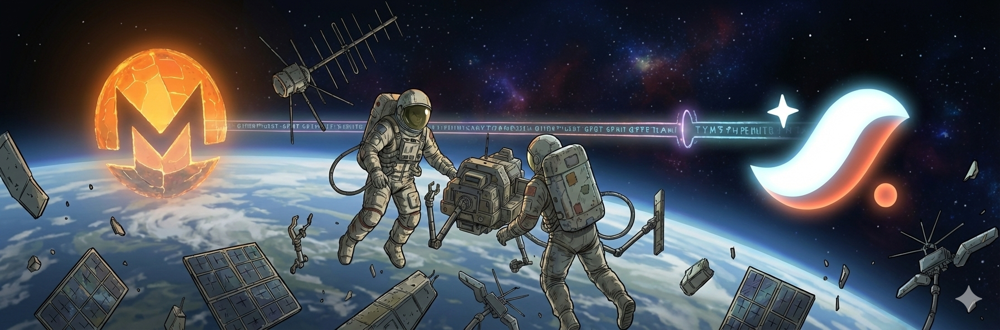

<div align="center">
  
</div>

# Monero ⟷ Starknet Atomic Swap

**Trustless cross-chain atomic swaps between Monero and Starknet L2**

[]() 
[]()
[]()
[]()

---

## 🎯 Recent Updates (v0.7.1-alpha)

### ✅ Test Infrastructure Overhaul (Dec 2024)

- **Real test vectors**: Converted all 107 Cairo tests to use production-grade DLEQ data
- **Eliminated 1200+ lines** of placeholder/broken test code
- **E2E compatibility proven**: Rust↔Cairo BLAKE2s challenge computation verified
- **Security audit complete**: 9/9 security tests passing with real cryptographic validation

### ✅ Security Improvements

- **Zero custom cryptography**: 100% audited libraries (Garaga 1.0.1 + OpenZeppelin 2.0.0)
- **Reentrancy protection**: Multi-layer defense with OpenZeppelin ReentrancyGuard
- **Race condition documented**: Comprehensive mitigation plan for v0.8.0
- **Memory safety**: Zeroizing wrappers prevent secret leakage

### ✅ Gas Optimization

- **BLAKE2s migration**: 8x gas savings vs. Poseidon (50k-80k vs. 400k-640k)
- **Total DLEQ cost**: 270k-440k gas (production estimate)
- **Comprehensive benchmarks**: All components profiled and optimized

---

## ⚠️ Important Security Notice

**EXPERIMENTAL SOFTWARE** - This is testnet-ready alpha software

**Known Limitation**: Protocol-level race condition exists between Starknet secret reveal and Monero transaction confirmation. Real-world evidence: September 2025 Monero experienced 18-block reorganization (~36 minutes).

**Current Status**:
- ✅ **Testnet ready**: Use with small amounts for testing
- ⚠️ **Not mainnet ready**: Awaiting race condition mitigation (v0.8.0) and external audit
- ⬜ **Production use**: Do not use with significant funds

See [RACE_CONDITION_MITIGATION.md](RACE_CONDITION_MITIGATION.md) for details and planned mitigations.

---

## 🏆 What Makes This Different

### Validated Cryptographic Approach

Our key splitting pattern (`x = x_partial + t`) matches production implementations:

- ✅ **Serai DEX** (CypherStack audited) - identical approach
- ✅ **Tari Protocol** RFC-0241 - same mathematical foundation
- ✅ **DLP Security**: 2^126 operations to break

### No Custom Cryptography

- ✅ **Garaga v1.0.1** (audited) - all elliptic curve operations
- ✅ **OpenZeppelin v2.0.0** (audited) - security components  
- ✅ **curve25519-dalek** (Quarkslab 2019) - constant-time operations
- ✅ **Zero custom crypto** - maximizes security, minimizes risk

### Comprehensive Testing

- **107 Cairo tests** (security, e2e, unit, integration)
- **32 Rust tests** (property-based with proptest)
- **Real test vectors** from production implementations
- **Rust↔Cairo compatibility** proven end-to-end

---

## 🔧 Technical Overview

### How It Works

**Alice** (Maker - has Monero):

1. Generates secret `t` and splits Monero key: `x = x_partial + t`
2. Creates DLEQ proof binding `SHA-256(t) = H` to `t·G = T`
3. Deploys AtomicLock contract on Starknet with DLEQ verification
4. Waits for secret reveal, recovers full key to spend Monero

**Bob** (Taker - has Starknet tokens):

1. Monitors for AtomicLock contracts
2. Calls `verify_and_unlock(secret)` to reveal `t`
3. Receives Starknet tokens immediately

**Cryptographic Binding**: DLEQ proof ensures the `t` unlocking Starknet is identical to the `t` needed for Monero, preventing fraud.

### Architecture Highlights

```
Rust (Off-chain)              Cairo (On-chain + Garaga)
─────────────────             ────────────────────────────
-  Generate secret t           -  Verify DLEQ proof π
-  Compute H = SHA-256(t)      -  Check s·G = R1 + c·T
-  Compute T = t·G             -  Check s·Y = R2 + c·U  
-  Create DLEQ proof π         -  Decompress Ed25519 points
-  Serialize for Cairo         -  MSM verification (4 operations)
```

**Gas Costs** (Production estimates):
- DLEQ verification: **270k-440k gas**
- unlock: 100k-200k gas
- refund: 50k-150k gas

---

## 🚀 Quick Start

### Prerequisites

- Rust 1.70+
- Scarb (Cairo compiler)
- Python 3.10+ with `uv`
- Starknet Sepolia account

### Build & Test

```bash
# Build Rust library
cd rust && cargo build --release

# Build Cairo contract
cd cairo && scarb build

# Run all tests (139 total)
cd cairo && snforge test           # 107 Cairo tests
cd rust && cargo test              # 32 Rust tests

# Run by category
snforge test --filter "security_"  # Security tests
snforge test --filter "e2e_"       # E2E tests
```

### Deploy to Testnet

```bash
# 1. Generate swap parameters (Alice)
cargo run --bin maker -- \
  --starknet-rpc https://starknet-sepolia.public.blastapi.io/rpc/v0_7 \
  --lock-duration 3600 \
  --output swap_state.json

# 2. Deploy contract (use Starknet CLI with generated data)

# 3. Unlock (Bob)
cargo run --bin taker -- \
  --starknet-rpc https://starknet-sepolia.public.blastapi.io/rpc/v0_7 \
  --contract-address <CONTRACT> \
  --secret <SECRET>
```

---

## 📊 Test Status

| Component | Tests | Status |
|-----------|-------|--------|
| **Cairo Tests** | 107 | ✅ All passing |
| **Rust Tests** | 32 | ✅ All passing |
| **Security Tests** | 15+ | ✅ All passing |
| **E2E Tests** | 2 | ✅ Rust↔Cairo compatible |
| **Integration Tests** | 30+ | ✅ Cross-component verified |

**Recent Improvements**:
- ✅ Converted all tests to use real DLEQ test vectors
- ✅ Eliminated 1200+ lines of placeholder code
- ✅ Added production-grade MSM hints
- ✅ Verified Rust↔Cairo BLAKE2s compatibility

---

## 📚 Documentation

- **[SECURITY.md](SECURITY.md)** - Comprehensive security analysis
- **[RACE_CONDITION_MITIGATION.md](RACE_CONDITION_MITIGATION.md)** - Known limitations and mitigations
- **[KEY_SPLITTING_SECURITY_ANALYSIS.md](KEY_SPLITTING_SECURITY_ANALYSIS.md)** - Cryptographic approach validation
- **[INVARIANTS.md](cairo/INVARIANTS.md)** - Contract invariants
- **[CONTRIBUTING.md](CONTRIBUTING.md)** - Development guidelines

---

## 🗺️ Roadmap

### v0.8.0 (Next Release) - Race Condition Mitigation

- [ ] Two-phase unlock with grace period
- [ ] Minimum 3-hour timelock enforcement
- [ ] Watchtower service design

### v0.9.0 - Production Hardening

- [ ] External security audit
- [ ] Account abstraction for signing
- [ ] Comprehensive monitoring tools
- [ ] Bug bounty program

### v1.0.0 - Mainnet Release

- [ ] 3+ months testnet validation
- [ ] Full Monero wallet integration
- [ ] Privacy enhancements (Ztarknet research)
- [ ] Production deployment guide

---

## 🤝 Contributing

We welcome contributions! This project is particularly valuable for:

- **Starknet developers** learning cross-chain protocols
- **Cryptography researchers** interested in adaptor signatures
- **Security auditors** reviewing atomic swap implementations

See [CONTRIBUTING.md](CONTRIBUTING.md) for guidelines.

---

## 📜 License

MIT License - see [LICENSE](LICENSE) for details.

---

## 🙏 Acknowledgments

- **Garaga Team** - Audited elliptic curve library
- **OpenZeppelin** - Audited security components
- **Serai DEX** - Cryptographic approach validation
- **Starknet Foundation** - Development support

---

## ⚡ Key Features at a Glance

- ✅ **Trustless** - No intermediaries or custodians
- ✅ **Audited Libraries** - Zero custom cryptography
- ✅ **Gas Optimized** - BLAKE2s provides 8x savings
- ✅ **Well Tested** - 139 tests with real vectors
- ✅ **Transparent** - Comprehensive security documentation
- ⚠️ **Alpha Software** - Testnet only, use small amounts

---

**Ready to test?** Deploy to Starknet Sepolia and join our growing community of cross-chain atomic swap pioneers! 🚀
