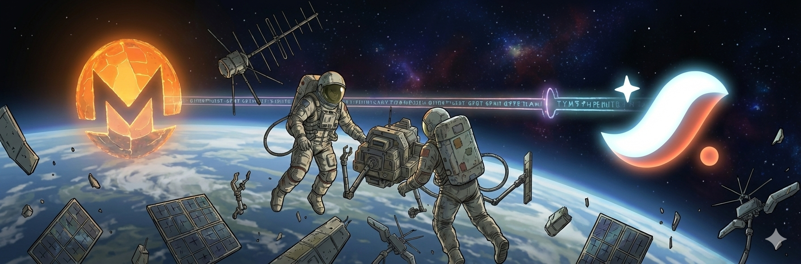

<div align="center">
  
</div>

# Monero↔Starknet Atomic Swap

**Trustless atomic swap protocol between Monero and Starknet using DLEQ proofs and two-party key generation.**

[](docs/SECURITY.md)
[](#testing)
[](LICENSE)

> **License: Apache 2.0 — Attribution and citation required.**
> If you use, fork, or build upon this code, you **must** include the [LICENSE](LICENSE) and [NOTICE](NOTICE) files and cite this project. Academic publications and derivative works **must** include the citation below. See [NOTICE](NOTICE) for full terms.
>
> ```
> Espejel, O. (2025). "Monero-Starknet Atomic Swaps: Trustless Cross-Chain Exchange
> via On-Chain DLEQ Verification and Optimistic RandomX Fraud Proofs."
> https://github.com/omarespejel/monero-starknet-atomic-swap
> ```

> ⚠️ **Alpha Software** — Not yet externally audited. Use only on testnets with test funds.

---

## Overview

Production-grade prototype implementation of a trustless atomic swap protocol enabling decentralized exchange of Monero (XMR) and Starknet L2 assets without trusted intermediaries.

**Core Protocol:**
- **Two-party key generation**: `x = s_a + s_b` (Serai DEX pattern, CypherStack audited)
- **DLEQ proofs**: Cryptographic binding between hashlock and adaptor point
- **MSM verification**: On-chain Ed25519 point verification via Garaga
- **Scalar compatibility**: Ed25519→BN254 safety checks (prevents Light Protocol #237)

**Security Model:**
- Zero custom cryptography — all operations use audited libraries
- Zero-scalar rejection — prevents edge case vulnerabilities
- Race condition monitoring — protocol-level detection
- Two-phase unlock — grace period for safety

---

## Status

| Component | Status | Notes |
|-----------|--------|-------|
| **Core Protocol** | ✅ Complete | Two-party keys, DLEQ proofs, scalar compatibility |
| **Cairo Contract** | ✅ Complete | DLEQ verification, MSM checks, reentrancy protection |
| **Rust Library** | ✅ Complete | Key generation, proof generation, Monero integration |
| **Tests** | ✅ 136+ passing | 36+ Rust, 100+ Cairo (security, E2E, integration) |
| **Starknet Signing** | ✅ Implemented | Invoke transactions (production-ready) |
| **Deployment** | ⚠️ Partial | Calldata builder ready, transaction signing pending |
| **External Audit** | 🔄 Pending | Required before mainnet |

**Production Blockers:**
- ⬜ Contract deployment transaction signing (use TypeScript scripts for now)
- ⬜ Live devnet E2E test execution
- ⬜ External security audit

---

## Quick Start

### Prerequisites

- Rust 1.70+
- Cairo/Scarb
- Python 3.10+ with `uv`
- Starknet account (testnet)
- Monero stagenet access (for testing)

### Build

```bash
# Rust library
cd rust && cargo build --release

# Cairo contract
cd ../cairo && scarb build
```

### Deploy Contract

```bash
# Option 1: TypeScript (Recommended)
cd scripts/ts && npm install && npm run deploy

# Option 2: Shell script
./scripts/deploy.sh sepolia 0xYOUR_DEPLOYER_ADDRESS

# Option 3: Python
python scripts/deploy_with_starknet_py.py
```

**⚠️ Critical**: Always use deployment scripts — they enforce sqrt hint validation (golden rule).

### Run Tests

```bash
# All tests
./scripts/test.sh

# Specific suites
./scripts/test.sh --security   # Security tests
./scripts/test.sh --e2e        # End-to-end tests
./scripts/test.sh --rust       # Rust only
./scripts/test.sh --cairo      # Cairo only
```

---

## Architecture

### Protocol Flow

1. **Alice (Maker)** generates spend share `s_a` and view share `v_a`, publishes `S_a = s_a·G`, `V_a = v_a·G`
2. **Bob (Taker)** generates spend share `s_b`, computes hashlock `H = SHA-256(s_b)`, creates DLEQ proof binding `H` to `S_b = s_b·G`
3. **Bob** deploys AtomicLock contract on Starknet with hashlock, adaptor point, and DLEQ proof
4. **Bob** reveals `s_b` on Starknet when ready, unlocking tokens
5. **Alice** detects reveal, recovers full key `x = s_a + s_b`, spends Monero

**Security**: Neither party can spend alone. Both shares required.

### Components

- **Cairo Contract** (`cairo/src/lib.cairo`): AtomicLock with DLEQ verification
- **Rust Library** (`rust/src/`): Key generation, DLEQ proofs, Monero integration
- **Python Tools** (`tools/`): Test data generation, hint generation
- **CLI Tools** (`rust/src/bin/`): Maker and taker commands

### Cryptographic Libraries

| Library | Version | Purpose | Audit Status |
|---------|---------|---------|--------------|
| `garaga` | `1.0.1` | EC operations (MSM, point validation) | Audited |
| `curve25519-dalek` | `4.1.3` | Ed25519 operations | Quarkslab 2019, CVE-2024-48896 fixed |
| `monero` | `0.21.0` | Monero address derivation | Battle-tested |
| OpenZeppelin Cairo | `2.0.0` | Reentrancy protection | Audited |

**Zero Custom Cryptography**: All cryptographic primitives from audited libraries.

---

## Security

### Security Properties

- ✅ **Atomic Swaps**: All-or-nothing execution
- ✅ **DLEQ Binding**: Cryptographically binds hashlock to adaptor point
- ✅ **Reentrancy Protection**: OpenZeppelin ReentrancyGuard + protocol-level checks
- ✅ **Point Validation**: On-curve checks, small-order rejection
- ✅ **Scalar Safety**: Zero-scalar rejection, BN254 compatibility checks
- ✅ **Race Condition Monitoring**: Protocol-level detection

### Threat Model

**Mitigated Threats:**
- Reentrancy attacks → OpenZeppelin guard + unlocked flag
- Invalid DLEQ proofs → Constructor verification (deployment fails if invalid)
- Small-order point attacks → Small-order checks for all points
- Scalar range attacks → Reduction modulo ED25519_ORDER
- Hash mismatch attacks → SHA-256 + MSM verification
- Timelock bypass → Timestamp checks enforced

**Known Limitations:**
- ⚠️ **Race Condition**: Protocol-level race between secret revelation and Monero confirmation
  - **Mitigation**: 3-hour timelock minimum, 2-hour grace period, race monitoring
  - **Recommendation**: Use only for testnet or swaps < $100 until mitigations verified

### Security Validation

- ✅ Validated against Serai DEX pattern (CypherStack audited)
- ✅ Zero-scalar rejection implemented (P0/P1 fixes)
- ✅ Scalar compatibility checks prevent Light Protocol #237 vulnerability
- ✅ Comprehensive test suite (136+ tests)
- 🔄 External audit pending

---

## Testing

### Test Organization

- **Security tests** (`test_security_*.cairo`): Critical security validations
- **E2E tests** (`test_e2e_*.cairo`): End-to-end Rust↔Cairo compatibility
- **Unit tests** (`test_unit_*.cairo`): Fast, isolated component tests
- **Integration tests** (`test_integration_*.cairo`): Cross-component tests

### Test Coverage

- ✅ 36+ Rust tests (two-party keys, DLEQ proofs, scalar compatibility, race monitoring)
- ✅ 100+ Cairo tests (security, E2E, integration, unit)
- ✅ Cross-chain E2E test (Rust→Cairo round-trip)
- ✅ Security property tests (zero-scalar, malicious Alice, secret reuse)

### Running Tests

```bash
# All tests
make test

# Specific categories
make test-security
make test-e2e
make test-rust
make test-cairo
```

---

## Documentation

- **[Architecture](docs/ARCHITECTURE.md)**: System design and component details
- **[Protocol](docs/PROTOCOL.md)**: Protocol specification and flow
- **[Security](docs/SECURITY.md)**: Security properties and threat model
- **[Dependencies](docs/AUDIT_DEPENDENCIES.md)**: Library choices and audit status
- **[Signing Implementation](docs/SIGNING_IMPLEMENTATION.md)**: Starknet transaction signing

---

## Project Structure

```
.
├── cairo/              # Cairo contract (AtomicLock)
│   ├── src/           # Contract source
│   └── tests/         # Test suite
├── rust/              # Rust library and CLI
│   ├── src/           # Library code
│   └── tests/         # Integration tests
├── tools/             # Python tooling (hints, verification)
├── scripts/           # Deployment automation
└── docs/              # Documentation
```

---

## Dependencies

### Rust

- `curve25519-dalek = "4.1.3"` — Ed25519 operations
- `monero = "0.21.0"` — Monero address derivation
- `blake2 = "0.10"` — BLAKE2s hashing
- `zeroize = "1.7"` — Secret zeroization
- `starknet-crypto = "0.7"` — STARK curve signing (non-macOS)

### Cairo

- `garaga = "1.0.1"` — EC operations (pinned)
- `openzeppelin = "2.0.0"` — Security components

---

## References

- [Garaga v1.0.1](https://github.com/keep-starknet-strange/garaga) — EC operations
- [OpenZeppelin Cairo Contracts](https://github.com/OpenZeppelin/cairo-contracts) — Security components
- [BLAKE2s Specification (RFC 7693)](https://www.rfc-editor.org/rfc/rfc7693)
- [Serai DEX](https://github.com/serai-dex/serai) — Reference implementation (CypherStack audited)

---

## Related Projects

| Repository | Description |
|------------|-------------|
| [monero-vm](https://github.com/omarespejel/monero-vm) | Fraud-proof RandomX verifier for trustless Monero verification on Starknet |

**Together these repos enable trustless Monero ↔ Starknet atomic swaps:**
- **monero-starknet-atomic-swap**: Handles the swap protocol (adaptor signatures, hashlock contracts)
- **monero-vm**: Verifies RandomX computation disputes (fraud proofs for Monero block validation)

---

## Citation

If you use this software in your project or research, **you must cite it**. See the [NOTICE](NOTICE) file for full attribution requirements.

```bibtex
@software{espejel2025monero_starknet,
  author       = {Espejel, Omar},
  title        = {Monero-Starknet Atomic Swaps: Trustless Cross-Chain
                  Exchange via On-Chain DLEQ Verification and Optimistic
                  RandomX Fraud Proofs},
  year         = {2025},
  url          = {https://github.com/omarespejel/xmr-starknet-atomic-lock},
  note         = {First commit: December 4, 2025}
}
```

---

## License

[Apache License 2.0](LICENSE) — You are free to use, modify, and distribute this software provided you:

1. **Include the LICENSE and NOTICE files** in any redistribution
2. **Cite this project** in any academic publication or derivative work (see [NOTICE](NOTICE))
3. **State changes** made to the original code

---

## Contributing

⚠️ **Security-sensitive project** — All cryptographic changes require review. See [CONTRIBUTING.md](CONTRIBUTING.md) for guidelines.

---

## Disclaimer

This software is provided "as is" without warranty. Use at your own risk. Not audited for production use. Do not use with significant funds until external security review is completed.
